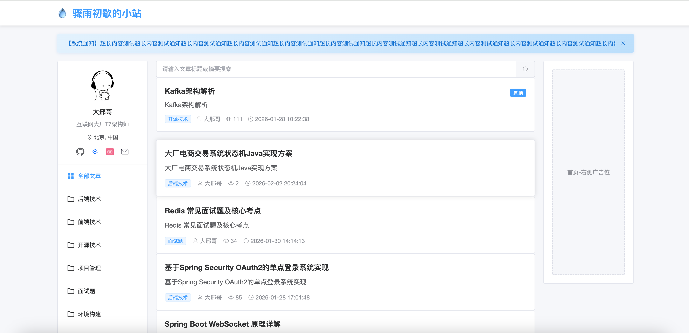
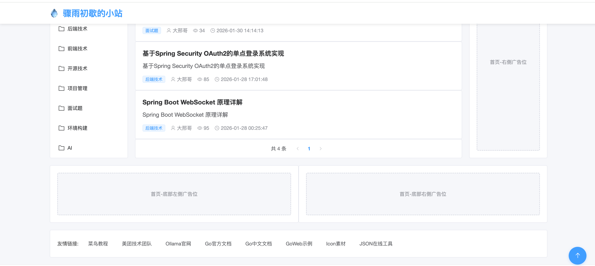
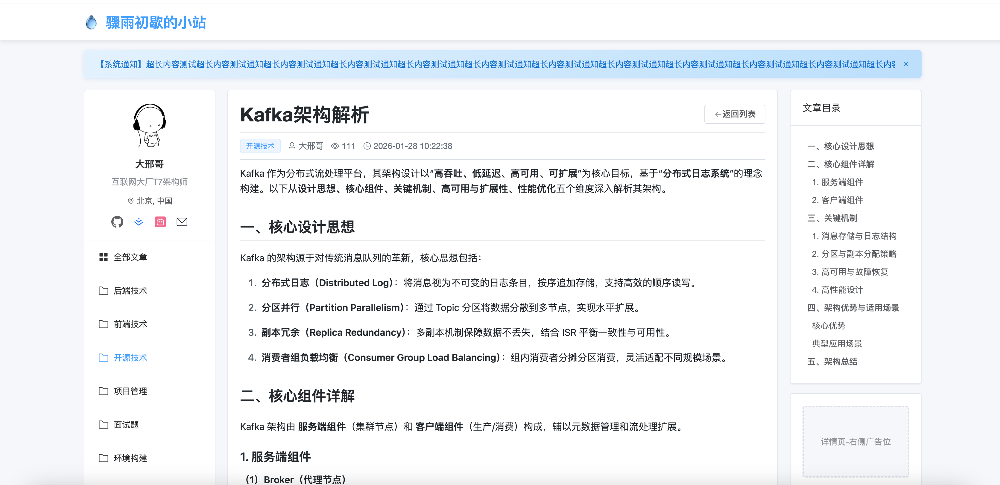
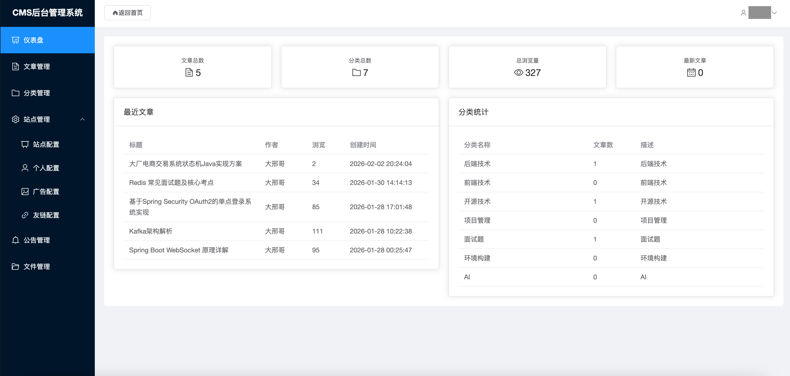
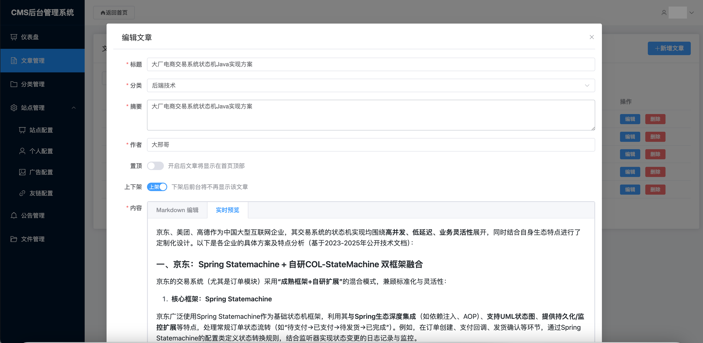
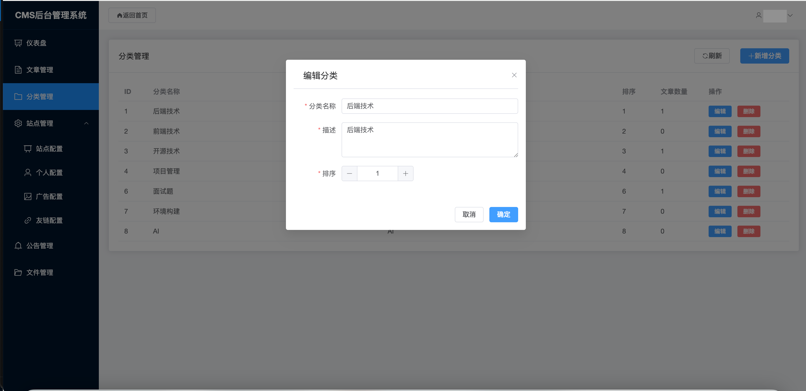
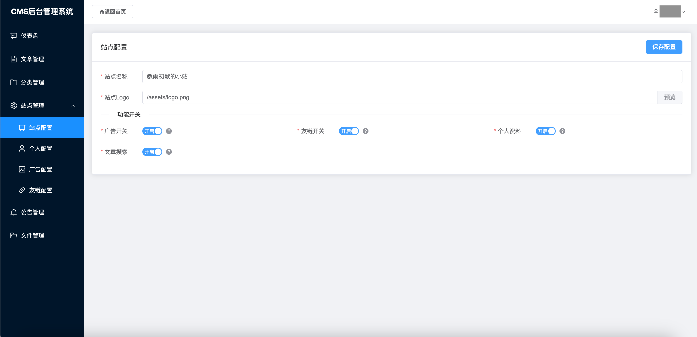
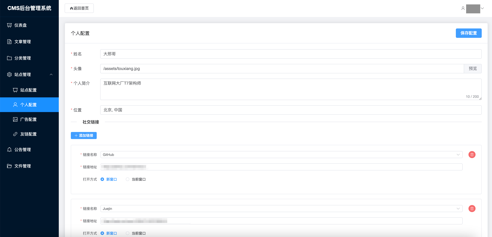
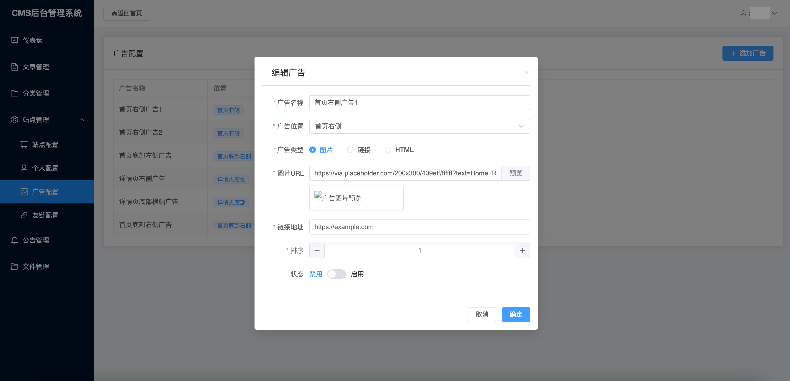
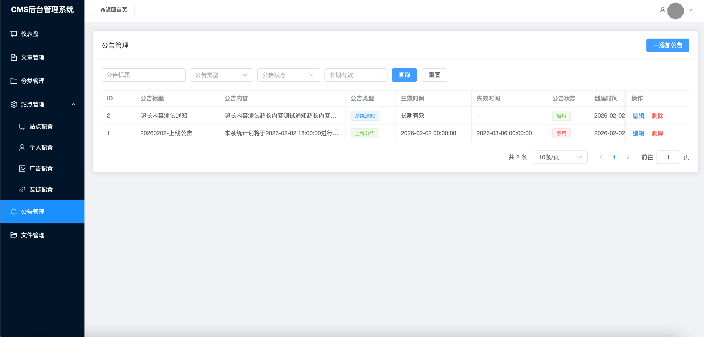

# cms-blog
一个用AI辅助编程开发的博客系统，前后端分离工程，分为前台和后台，服务端三部分

## 整体架构

> 1. 采用前后端分离实现的一个轻量级，配置化博客系统
>
> 2. 前端采用vite+vue+pinia+element-plus开发，分为前台和后台两部分，前台主要负责信息展示，后台主要负责数据编辑，文章采用markdown格式编写，前台渲染时进行转义并生成菜单导航
> 3. 后端采用Springboot3.5.6+springsecuirty6.5.5+mybatis-plus+java21实现的数据接口服务，权限部分基于auth2协议实现
>
> 

略~

## 前端截图

### 首页1

### 首页2

### 文章详情页

## 后端截图

### 后台首页

### 文章管理

### 分类管理

### 站点配置

### 个人配置

### 广告配置

### 友链配置

### 公告管理

